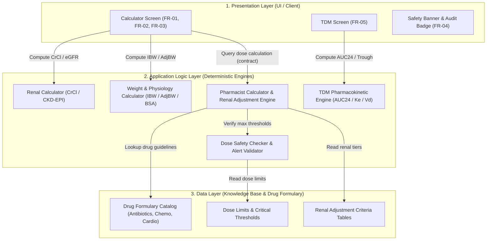
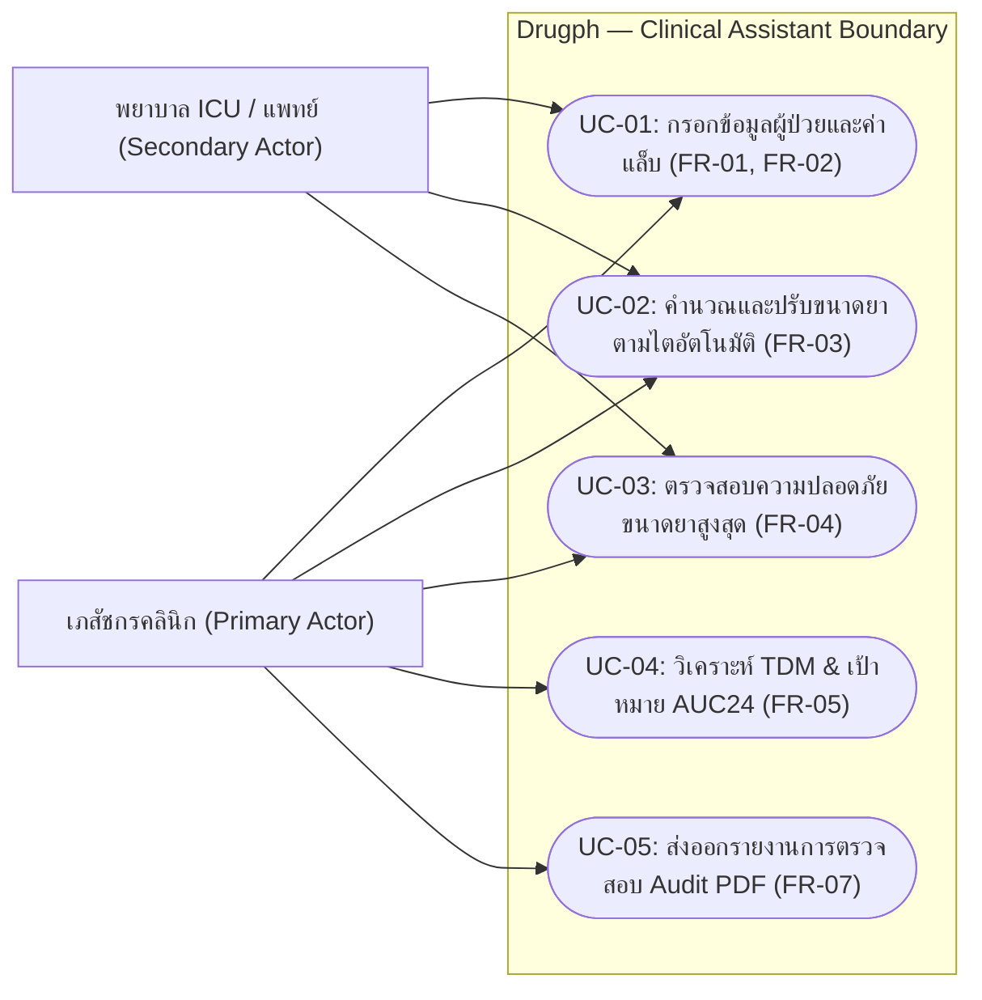
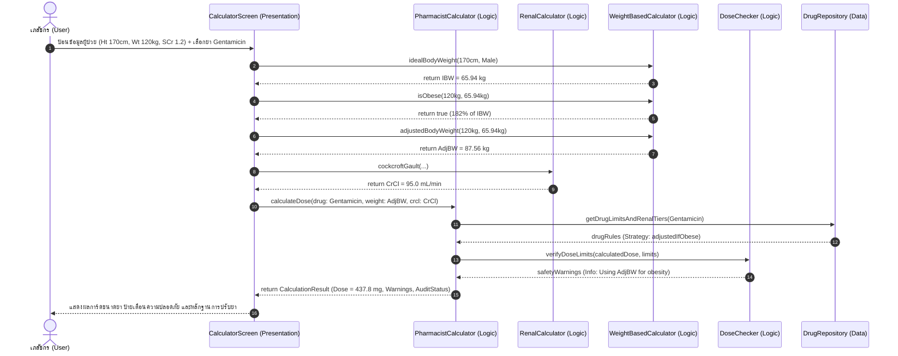
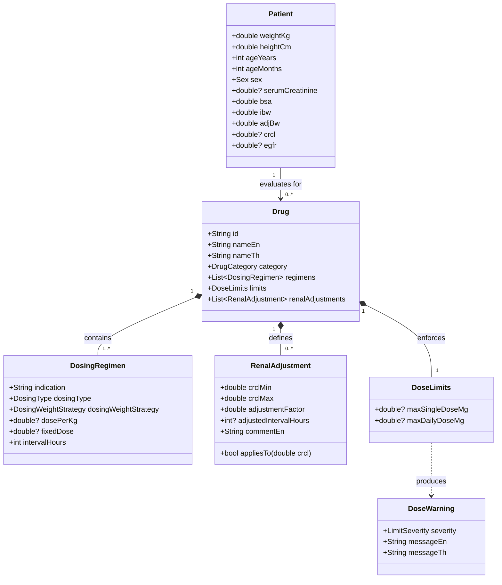

# Software Architecture & Technical Design — Drugph
**Course:** Introduction to Software Engineering (15031001) — Academic Year 2569  
**Milestone:** M3 (Software Design & Modeling) — Final Delivery  
**Project:** Drugph — Deterministic Clinical Drug Dosage & Safety Verification Engine  

---

## 1. สถาปัตยกรรม 3 ชั้น (Three-Tier Architecture)

ระบบ Drugph ยึดถือหลักการแบ่งสถาปัตยกรรมออกเป็น 3 ชั้น เพื่อให้เกิด **High Cohesion (ความเกาะกลุ่มภายในส่วนสูง)** และ **Low Coupling (การพึ่งพาระหว่างส่วนต่ำ)** และยึดหลัก **Separation of Concerns**:

### การแบ่งหน้าที่และความเป็นอิสระของแต่ละชั้น:
1. **Presentation Layer (UI):** มีหน้าที่รับข้อมูลผู้ป่วย (น้ำหนัก, ส่วนสูง, เพศ, อายุ, SCr) และแสดงผลลัพธ์ขนาดยา การ์ดคำเตือน และสถานะ Audit Badge **โดยไม่มีการตัดสินกฎทางคณิตศาสตร์หรือการแพทย์ใน UI Widget เอง**
2. **Application Logic Layer:** บรรจุสมการทางคณิตศาสตร์และการแพทย์ที่เป็น Deterministic ทั้งหมด (Cockcroft-Gault, CKD-EPI 2021, Devine IBW, Winter AdjBW, Calvert Formula, Sawchuk-Zaske PK) ประมวลผลและส่งผลลัพธ์พร้อมรายการแจ้งเตือนกลับไปยัง UI ผ่าน Data Transfer Object
3. **Data Layer:** จัดเก็บพจนานุกรมยาและตารางเกณฑ์การปรับยาตามไตที่เป็นมาตรฐานทางการแพทย์ โดยถูกห่อหุ้ม (Encapsulated) ไว้อย่างมิดชิด ไม่ให้ UI เข้าถึงได้โดยตรง

---

## 2. การตัดสินใจเชิงสถาปัตยกรรม (Architectural Decision Records - ADR)

### ADR-01: การเลือกใช้ Client-Side Deterministic Architecture เหนือ Cloud API
- **Context:** ต้องการให้ระบบทำงานได้รวดเร็ว ปลอดภัยตามกฎหมาย PDPA (NFR-05) และพร้อมใช้งานในพื้นที่อับสัญญาณในโรงพยาบาล เช่น ห้องผ่าตัดหรือห้องฉุกเฉิน (NFR-02)
- **Decision:** พัฒนาตัวคำนวณทั้งหมดเป็น Pure Dart Engine ที่คอมไพล์ทำงานฝั่ง Client 100% (บน Browser / Flutter Web / Mobile) โดยไม่มีการส่งค่าพารามิเตอร์ของผู้ป่วยออกไปยัง Remote Server
- **Consequence:** ได้ Zero Network Latency (< 10 ms), ไม่มีค่าใช้จ่าย Server โฮสต์ฐานข้อมูล และข้อมูลผู้ป่วยปลอดภัยสมบูรณ์ แต่ต้องแลกกับการอัปเดตสูตรยาที่ต้อง deploy แอปเวอร์ชันใหม่

### ADR-02: การใช้ Rounding Tolerance ปิดช่องว่างทศนิยมในตาราง Renal Adjustment
- **Context:** ในเวชปฏิบัติจริง ผลแล็บ Serum Creatinine มีทศนิยม ทำให้ CrCl เป็นเลขทศนิยม (เช่น 25.5 mL/min) ซึ่งหลุดช่องว่างระหว่างช่วงตารางยาในตำรา (เช่น 10–25 และ 26–50) ส่งผลให้คนไข้ได้ยาเต็มขนาด (FR-03)
- **Decision:** ออกแบบเมท็อด `RenalAdjustment.appliesTo(crcl)` ให้ใช้การปัดเศษ `crcl.roundToDouble()` หรือความคลาดเคลื่อน $0.5$ Unit เพื่อจัดกลุ่มผู้ป่วยเข้าช่วงการปรับยาที่ถูกต้องตามความตั้งใจของตำราแพทย์
- **Consequence:** ป้องกันการเกิด Dosing Gap 100% ผู้ป่วยได้รับยาที่ลดขนาดตามระดับการทำงานของไตอย่างปลอดภัย

---

## 3. ไดอะแกรมเชิงสถาปัตยกรรม (UML Diagrams)

### 3.1 UML Use Case Diagram (ภาพรวมระบบและผู้ใช้)

### 3.2 Sequence Diagram: กระบวนการคำนวณและปรับขนาดยา (Dosing & Safety Flow)

### 3.3 Class Diagram / Logical Data Model (โครงสร้างข้อมูลเชิงตรรกะ)

---

## 4. โมเดลข้อมูลเชิงตรรกะ (Logical Data Model - Tech Agnostic)

| เอนทิตี (Entity) | ฟิลด์ข้อมูล (Fields & Types) | ความสัมพันธ์ (Relationship) | ความต้องการที่รองรับ (Traced FR) |
|---|---|---|---|
| **Patient** | `id: String`, `weightKg: Float`, `heightCm: Float`, `ageYears: Int`, `sex: Enum[Male,Female]`, `serumCreatinine: Float?` | 1 ราย มีการประเมินได้หลายคำสั่งยา | FR-01, FR-02 |
| **Drug** | `id: String`, `genericName: String`, `category: Enum`, `standardDose: Float`, `isHighAlert: Bool` | 1 ชนิดยา มีหลายขนาดตามข้อบ่งใช้ | FR-03, FR-04 |
| **RenalTier** | `crclMin: Float`, `crclMax: Float`, `doseFactor: Float`, `adjustedInterval: Int` | เป็นส่วนประกอบของ Drug | FR-03 |
| **SafetyAlert** | `severity: Enum[Info, Soft, Hard]`, `message: String`, `actionRequired: String` | เกิดขึ้นจากการตรวจสอบขนาดยา | FR-04 |
| **TdmRecord** | `doseMg: Float`, `tauHours: Int`, `kePerHour: Float`, `vdLiters: Float`, `targetAucMin: Float`, `targetAucMax: Float` | 1 เคส TDM เชื่อมกับ Patient | FR-05 |

*หมายเหตุ: โมเดลข้อมูลนี้เป็นเชิงตรรกะ ไม่มีการผูกติดกับรูปแบบตาราง SQL หรือ Firestore Document โดยสามารถนำไปประยุกต์ใช้กับหน่วยความจำแบบ In-Memory State ได้โดยตรง*
